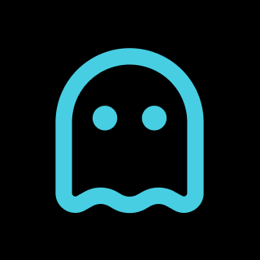
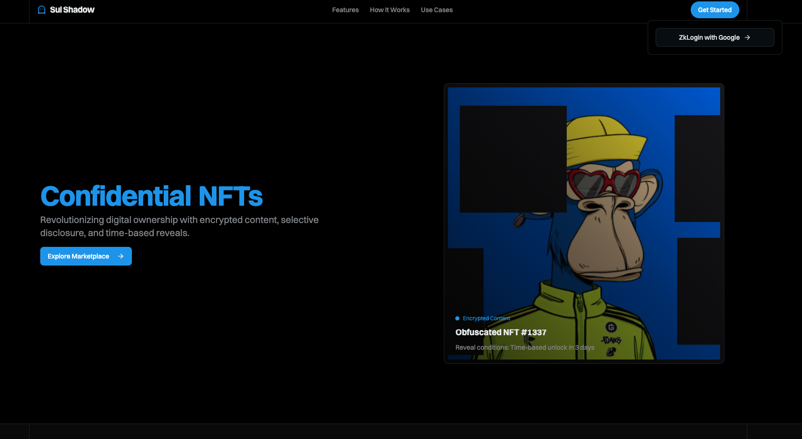

<center><h1> SuiShadow </h1></center>

<center></center>


> This Project came 4th in the <a href="https://blog.sui.io/2025-sui-overflow-hackathon-winners/#cryptography">cryptography track</a> of the SuiOverflow25 Hackathon. 

> Sui Shadow is an innovative, privacy-first art platform built on the SUI blockchain, where artists encrypt their work into hidden tiles and mint suspense-filled NFTs. Powered by Key encryption security from Sui `Seal`, each artwork is encrypted using `SUI Seal`and released only to legitimate buyers. All encrypted chunks live off-chain in `Walrus`, keeping gas costs minimal and storage unlimited. The artists identity is verified using `zklogin` as the log-in option on the app . Perfect for creators who want to monetize secret reveals and collectors craving exclusive digital treasures, Sui Shadow turns every purchase into a thrilling unmasking experience backed by robust blockchain security.

> Link to <a href="https://pitch.com/v/sui-shadow-ifc697/37f3604a-d0f2-40ea-95b5-4fac4e79fe88"> Pitch deck </a><br>
> Link to <a href="https://www.youtube.com/watch?v=CE_naEEH2ZU"> Video </a> </br>
> Link to <a href="https://suishadow.gitbook.io/suishadow"> Docs </a>

---

## Table of Contents

1. [Introduction](#introduction)  
2. [User Flow](#user-flow)  
3. [Architecture](#architecture)  
4. [Challenges](#challenges)  
5. [Future](#future)
6. [Try it out](#try-it-out)
7. [Conclusion](#conclusion)

---

# Introduction

**Sui Shadow** is a NFT marketplace on the Sui blockchain where artists can sell “hidden” or **obfuscated** images. Instead of minting a clear‐text PNG on-chain, which can be stolen or used to mint NFT's by other people:

1. Splits an image into multiple blocks/tiles (we are using 4 blocks of 1/10th the images dimensions)  
2. `Seal` encrypts each block and the coordinates . 
3. Builds a Merkle tree over the ciphertexts to guarantee integrity. (we are using SHA-256 to build the merkleroot)
4. Stores all encrypted blocks off‐chain in Walrus . (the coordinates as well as the removed blocks are encrypted and stored) 
5. Mints an NFT which has a special merkle root field:
   - A **Merkle root** (32 bytes)  


When a buyer pays the seller in SUI, the payment is verified and the buyer is automatically added to the allowlist and is able to successfully fetch the Decrypt the ecnrypted parts, and the front end fetches ciphertexts from Walrus, verifies Merkle proofs, decrypts the blocks, and reassembles the original image—all on the client side.

By shifting bulk storage and computation off‐chain, while keeping a tamper‐proof Merkle root on‐chain, we ensure:

- **Authenticity**: No one can swap or alter encrypted blocks without invalidating the Merkle root.  
- **Efficiency**: On‐chain gas fees only cover a 32‐byte root and a string blob ID.  
- **Privacy/Exclusivity**: Until purchase, viewers only see a blacked‐out or watermarked preview.  

---

## User Flow

Below is the high‐level sequence of steps for each participant (Seller, Marketplace, Buyer).



## 🌐 Workflow Overview

1. **Artist Obfuscates & Encrypts**  
   - The original image is split into multiple tiles and associated coordinates.  
   - Each tile + coordinate bundle is encrypted using a threshold scheme, ensuring that decryption requires approval from the on-chain allowlist.

2. **Upload to Decentralized Storage (Walrus)**  
   - The encrypted blobs (tiles) are uploaded to a decentralized blob store.  
   - Each blob receives a unique content address (Blob ID), which is recorded on-chain as part of the NFT metadata.

3. **Mint NFT & Store Commitments**  
   - A Merkle tree is built over all ciphertext blobs, producing a single Merkle root.  
   - The NFT smart contract mints a token that holds:
     - The Merkle root  
     - A list of Blob IDs pointing to the encrypted tiles on Walrus  
     - Basic metadata (preview URL, title, artist, etc.)

4. **Collector Purchase & Allowlist Approval**  
   - A buyer pays for the NFT in SUI.  
   - Upon payment, the buyer’s zero-knowledge identity is added to the on-chain allowlist.  
   - The buyer receives the session or decryption keys tied to their zklogin credential.

5. **Client-Side Fetch & Decrypt**  
   - The collector’s browser fetches encrypted tiles from Walrus using their Blob IDs.  
   - Each tile’s Merkle proof is verified against the on-chain root.  
   - The tiles are decrypted client-side using the threshold keys granted via on-chain approval.  
   - Finally, the tiles are reassembled into the full-resolution image in the browser.


</img>
---

## Architecture

</img>

The system is divided into four logical layers:

<!-- ───────────────────────────────────────────────────────────────────────────── -->


### 1. Zero-Knowledge Login (Enoki)
- **Purpose**: Simplifies onboarding by providing an OAuth-style login experience.  
- **How it Works**:  
  - Users sign in using familiar identity providers (e.g., Google).  
  - Upon successful login, they receive a zk-anonymous credential bound to a Sui address.  
  - This credential is used to generate a session key, which proves ownership without revealing personal details.  
- **Benefit**: Eliminates the need for seed-phrase wallets or complex wallet-connect flows—newcomers can start interacting immediately.

### 2. Threshold Encryption (Seal)
- **Purpose**: Encrypts each image tile + coordinate so that decryption requires on-chain approval.  
- **How it Works**:  
  - A unique encryption ID is derived for each bundle of tiles.  
  - The Seal client performs a threshold encryption (e.g., requires 2 out of N key shares).  
  - Encryption keys and ciphertexts are managed natively by the Sui VM.  
- **Benefit**:  
  - No need for off-chain AES libraries or manual key exchange.  
  - On-chain enforcement guarantees that only allowlisted session keys can decrypt.

### 3. Decentralized Storage (Walrus)
- **Purpose**: Stores large encrypted blobs off-chain in a decentralized network.  
- **How it Works**:  
  - Encrypted tiles are uploaded via a simple HTTP API (PUT/GET).  
  - Each tile receives a content-addressed Blob ID.  
  - Redundancy and replication are handled by the Walrus network automatically.  
- **Benefit**:  
  - No centralized servers required for hosting large media.  
  - Content-addressable URLs ensure immutability and verifiable integrity.


### 4. OnChain Contracts(SUI)
- **NFT Contract**  
  - **Role**: Minting and transferring NFTs, storing the Merkle root, and linking to Blob IDs.  
  - **Key Data**:  
    - `merkleroot` (32-byte SHA-256 root over encrypted tiles)  
    - List of Blob IDs pointing to encrypted content on Walrus

- **Allowlist Contract**  
  - **Role**: Manages which session keys (tied to zkLogin addresses) can decrypt a given encryption ID.  
  - **Key Data**:  
    - A capability-based allowlist object  
    - Mapping from encryption IDs → authorized session keys

- **Marketplace Contract**  
  - **Role**: Stores and shares a public list of all Blob IDs for browsing.  
  - **Key Data**:  
    - A shared vector of all active Blob IDs in the storefront  
    - Read-only function allowing front-end clients to list available NFTs 
  

## Challenges

Building a “pay‐to‐reveal” NFT system involved tackling several nontrivial hurdles:

- **`ParseZKLogin` Function Errors**  
  We faced issues with the `ParseZKlogin` function, which caused failures in extracting and verifying zkLogin credentials. This slowed down integration of zero-knowledge authentication and required debugging around data serialization.

- **Balancing Obfuscation vs. Visibility**  
  Determining how much obfuscation is enough proved challenging. Over-obfuscating can render images unrecognizable or unattractive to potential buyers, while under-obfuscating may allow AI or manual reconstruction from the preview. Striking the right balance between exclusivity and visibility required iterative testing and feedback.

- **zkLogin Addresses & Seal Decryption Incompatibility**  
  Since Seal ties encryption permissions to specific Sui addresses, and zkLogin-derived addresses behave differently from standard key-pair-based accounts, decryption sometimes failed when using zkLogin credentials. This required additional work to align address formats, session key handling, and on-chain approval flows.


---

## Future 

- **On-Chain Randomness for Obfuscation**  
  We plan to leverage Sui’s on-chain randomness oracle (e.g., a VRF) to drive tile selection and arrangement. By incorporating verifiable random values in the obfuscation process, each mint will use a unique, unpredictable pattern—preventing attackers from predicting tile layout in advance.

- **AI-Powered Obfuscation Assessment**  
  To automate the balance between privacy and preview quality, we will integrate an AI model that evaluates how recognizable an obfuscated image remains. During the obfuscation step, the model can provide a “visibility score” to ensure human and machine-based models cannot reconstruct the artwork from the preview.

- **Dynamic Blocksize Selection**  
  Instead of a fixed 2×2 split for every artwork, we will analyze each image’s complexity and detail distribution to choose an optimal blocksize (e.g., 4×4, 8×8, or irregular grids). Simpler images might require fewer, larger tiles to preserve viewer interest, while highly detailed images could be split into many small tiles for stronger obfuscation.

- **Enhanced Merkle Tree Implementation**  
  We will replace the current static, full-binary Merkle tree with an optimized structure (e.g., a sparse Merkle tree or Merkle forest) that supports incremental updates, batch proofs, and smaller proof sizes. This will speed up tree construction for large tile counts, enable efficient partial reveals, and reduce on-chain gas costs for proof verification.


## Try-it-out

As we removed the need for central server's everything can be done straight from the frontend , so it is very easy to use it on your own 

``` 
git clone https://github.com/Sahilgill24/SuiShadow.git
cd ui
pnpm i
pnpm dev
# just place your OAuth clientID's and Enoki API_Key 
# be careful while selecting the size of the image , if too large it would give an error that the JSON RPC can't send more data . 
```


## Conclusion

Sui Shadow demonstrates how to build a modern, privacy‐preserving, “pay‐to‐reveal” NFT system on the Sui blockchain. By combining:

- **zkLogin** for wallet‐based identity  
- **Sui Seal** for encryption  
- **Merkle proofs** for off‐chain integrity  
- **Walrus storage** for large blobs  

we enable artists to sell exclusive, high‐value artwork without ever storing the full image on‐chain. Buyers can trust that the artwork they pay for is genuine, remains verifiable, and gets securely revealed only upon purchase.

Feel free to explore the contracts under `nftverifier/` and the front‐end under `ui/`. Pull requests, bug reports, and new feature proposals are very welcome!

---

